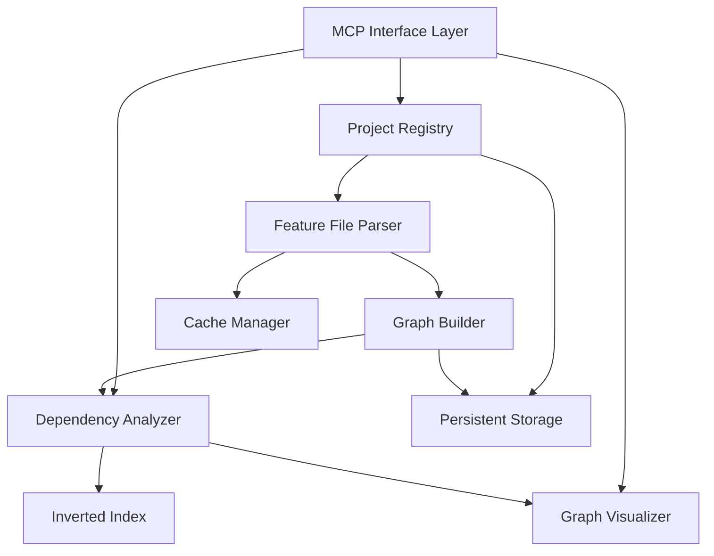

# Design Document: Karate Feature Graph Analyzer

## Overview

The Karate Feature Graph Analyzer is a Python-based MCP (Model Context Protocol) tool that provides comprehensive dependency analysis for Karate Framework test suites. The system parses Gherkin-format feature files, extracts test cases, workflows, API calls, page objects, and database operations, then constructs an interactive dependency graph enabling impact analysis and code reuse identification.

### Key Capabilities

- **Multi-project Management**: Register and analyze multiple Karate projects with persistent configuration
- **Dependency Graph Construction**: Build directed graphs showing relationships between test components
- **Impact Analysis**: Identify all test cases affected by changes to APIs, pages, workflows, or database operations
- **Interactive Visualization**: Web-based graph UI with filtering, search, and exploration capabilities
- **Reusability Analysis**: Identify common workflows, APIs, and pages across projects
- **AI Agent Integration**: MCP protocol interface optimized for fast code retrieval and analysis
- **Incremental Updates**: Detect file changes and update graphs without full re-analysis

### Design Principles

1. **Separation of Concerns**: Parser, graph builder, analyzer, visualizer, and MCP interface are independent modules
2. **Performance First**: Inverted indices, caching, and incremental updates ensure sub-100ms query response
3. **Extensibility**: Configurable parsing rules support different Karate project styles and conventions
4. **Robustness**: Graceful handling of malformed files, unresolved references, and circular dependencies

## Architecture

### System Components



### Component Responsibilities

#### MCP Interface Layer
- Exposes tool functions following MCP protocol specification
- Validates input parameters and returns structured JSON responses
- Handles error conditions with descriptive error codes
- Manages batch query operations for efficiency

#### Project Registry
- Stores project configurations (name, root path, feature file locations)
- Validates project paths and feature file existence
- Persists configurations to disk (JSON format)
- Provides project listing and lookup operations

#### Feature File Parser
- Parses Gherkin syntax using configurable grammar
- Extracts scenarios, scenario outlines, tags, and steps
- Identifies `call read()` statements with path resolution
- Extracts API endpoints from URL patterns
- Identifies page object references and database operations
- Handles syntax variations through configurable regex patterns
- Returns structured AST representation

#### Graph Builder
- Constructs directed graph from parsed ASTs
- Creates nodes for test cases, workflows, APIs, pages, database operations
- Creates edges representing dependencies
- Stores metadata (file paths, line numbers, Jira tags)
- Detects circular dependencies
- Supports incremental graph updates

#### Dependency Analyzer
- Performs graph traversal for impact analysis
- Calculates transitive dependencies
- Identifies reusable components across projects
- Computes usage frequency statistics
- Maintains inverted indices for fast lookups
- Provides query interface for node and edge retrieval

#### Graph Visualizer
- Renders interactive web-based graph visualization
- Implements filtering by node type
- Provides search by name or Jira tag
- Highlights selected nodes and dependencies
- Supports zoom, pan, and layout algorithms
- Indicates circular dependencies visually

#### Cache Manager
- Caches parsed ASTs keyed by file path and modification time
- Implements LRU eviction policy
- Detects file changes through timestamp comparison
- Provides cache invalidation interface

#### Inverted Index
- Maps Jira tags → test cases
- Maps API endpoints → test cases
- Maps page objects → test cases
- Maps database operations → test cases
- Supports fast O(1) lookup operations

#### Persistent Storage
- Stores project registry (JSON)
- Stores serialized graphs (JSON/GraphML)
- Manages file-based persistence with atomic writes

## Components and Interfaces

### Feature File Parser

```python
class FeatureFileParser:
    """Parses Karate feature files into structured AST."""
    
    def __init__(self, config: ParserConfig):
        """Initialize parser with configuration for syntax variations."""
        pass
    
    def parse_file(self, file_path: str) -> FeatureAST:
        """Parse a single feature file.
        
        Returns:
            FeatureAST with scenarios, tags, dependencies
            
        Raises:
            ParseError: If file is malformed
        """
        pass
    
    def extract_scenarios(self, ast: FeatureAST) -> List[Scenario]:
        """Extract all Scenario and Scenario Outline definitions."""
        pass
    
    def extract_dependencies(self, scenario: Scenario) -> List[Dependency]:
        """Extract call read(), API calls, page objects, DB operations."""
        pass
    
    def resolve_path(self, call_statement: str, context: PathContext) -> str:
        """Resolve relative paths and variable expressions."""
        pass
```

### Graph Builder

```python
class GraphBuilder:
    """Constructs dependency graph from parsed feature files."""
    
    def __init__(self):
        self.graph = DirectedGraph()
        
    def add_test_case(self, scenario: Scenario, metadata: NodeMetadata) -> NodeId:
        """Add test case node to graph."""
        pass
    
    def add_dependency(self, from_node: NodeId, to_node: NodeId, 
                      dep_type: DependencyType) -> EdgeId:
        """Add directed edge representing dependency."""
        pass
    
    def detect_cycles(self) -> List[List[NodeId]]:
        """Detect circular dependencies using DFS."""
        pass
    
    def build_from_project(self, project: Project) -> DependencyGraph:
        """Build complete graph for a project."""
        pass
```

### Dependency Analyzer

```python
class DependencyAnalyzer:
    """Analyzes dependency graph for impact and reusability."""
    
    def __init__(self, graph: DependencyGraph):
        self.graph = graph
        self.indices = InvertedIndices()
        
    def impact_analysis(self, component_id: str) -> ImpactResult:
        """Find all test cases affected by component change.
        
        Returns:
            ImpactResult with affected test cases, dependency paths, depths
        """
        pass
    
    def find_dependencies(self, node_id: str, 
                         transitive: bool = True) -> List[Node]:
        """Find direct or transitive dependencies."""
        pass
    
    def find_common_components(self, projects: List[Project]) -> List[ReusableComponent]:
        """Identify reusable workflows, APIs, pages across projects."""
        pass
    
    def query_by_tag(self, jira_tag: str) -> List[Node]:
        """Fast lookup using inverted index."""
        pass
```

### MCP Tool Interface

```python
class KarateGraphAnalyzerTool:
    """MCP protocol interface for graph analyzer."""
    
    def register_project(self, name: str, root_path: str) -> Result:
        """Register a new Karate project."""
        pass
    
    def list_projects(self) -> List[ProjectInfo]:
        """List all registered projects."""
        pass
    
    def analyze_project(self, project_name: str) -> AnalysisResult:
        """Build dependency graph for project."""
        pass
    
    def query_dependencies(self, component_id: str) -> DependencyResult:
        """Query dependencies for a component."""
        pass
    
    def impact_analysis(self, component_id: str) -> ImpactResult:
        """Perform impact analysis for component change."""
        pass
    
    def get_node_details(self, node_id: str) -> NodeDetails:
        """Get full metadata for a node."""
        pass
    
    def find_common_components(self, project_names: List[str]) -> List[ReusableComponent]:
        """Find reusable components across projects."""
        pass
    
    def export_graph(self, project_name: str, format: str) -> str:
        """Export graph to JSON or GraphML."""
        pass
    
    def import_graph(self, data: str, format: str) -> Result:
        """Import graph from JSON or GraphML."""
        pass
```

## Data Models

### Core Domain Models

```python
@dataclass
class Scenario:
    """Represents a test case (Scenario or Scenario Outline)."""
    name: str
    type: ScenarioType  # SCENARIO or SCENARIO_OUTLINE
    tags: List[str]
    jira_tags: List[str]
    file_path: str
    line_number: int
    steps: List[Step]
    examples: Optional[Examples]  # For Scenario Outlines

@dataclass
class Dependency:
    """Represents a dependency extracted from feature file."""
    type: DependencyType  # WORKFLOW, API, PAGE, DATABASE
    target: str  # File path, URL, or operation identifier
    line_number: int
    parameters: Dict[str, Any]

@dataclass
class Node:
    """Graph node representing a test component."""
    id: str
    type: NodeType  # TEST_CASE, WORKFLOW, API, PAGE, DATABASE
    name: str
    metadata: NodeMetadata

@dataclass
class NodeMetadata:
    """Metadata associated with graph nodes."""
    file_path: Optional[str]
    line_number: Optional[int]
    jira_tags: List[str]
    project_name: str
    additional_data: Dict[str, Any]

@dataclass
class Edge:
    """Directed edge representing dependency relationship."""
    id: str
    from_node: str
    to_node: str
    type: DependencyType

@dataclass
class DependencyGraph:
    """Complete dependency graph for a project."""
    project_name: str
    nodes: Dict[str, Node]
    edges: Dict[str, Edge]
    cycles: List[List[str]]  # Circular dependency chains

@dataclass
class ImpactResult:
    """Result of impact analysis."""
    changed_component: str
    affected_test_cases: List[AffectedTestCase]
    total_count: int

@dataclass
class AffectedTestCase:
    """Test case affected by a change."""
    node_id: str
    name: str
    jira_tags: List[str]
    dependency_path: List[str]  # Path from test case to changed component
    depth: int

@dataclass
class ReusableComponent:
    """Component used across multiple projects."""
    type: NodeType
    name: str
    usage_count: int
    instances: List[ComponentInstance]

@dataclass
class ComponentInstance:
    """Specific instance of a reusable component."""
    project_name: str
    file_path: str
    node_id: str

@dataclass
class Project:
    """Registered Karate project."""
    name: str
    root_path: str
    feature_file_patterns: List[str]
    parser_config: ParserConfig

@dataclass
class ParserConfig:
    """Configuration for parser to handle syntax variations."""
    jira_tag_patterns: List[str]  # Regex patterns for Jira tags
    workflow_directories: List[str]
    page_object_directories: List[str]
    variable_patterns: Dict[str, str]  # Variable name → resolution pattern
    api_extraction_rules: List[str]
```

### Inverted Index Structure

```python
class InvertedIndices:
    """Fast lookup indices for common queries."""
    
    jira_tag_index: Dict[str, List[str]]  # tag → [node_ids]
    api_endpoint_index: Dict[str, List[str]]  # endpoint → [node_ids]
    page_object_index: Dict[str, List[str]]  # page → [node_ids]
    database_op_index: Dict[str, List[str]]  # operation → [node_ids]
```

### Graph Export Formats

**JSON Format:**
```json
{
  "project_name": "my-karate-project",
  "timestamp": "2025-01-15T10:30:00Z",
  "nodes": [
    {
      "id": "tc_001",
      "type": "TEST_CASE",
      "name": "Verify user login",
      "metadata": {
        "file_path": "features/auth/login.feature",
        "line_number": 10,
        "jira_tags": ["PROJ-123"],
        "project_name": "my-karate-project"
      }
    }
  ],
  "edges": [
    {
      "id": "edge_001",
      "from_node": "tc_001",
      "to_node": "wf_auth",
      "type": "WORKFLOW"
    }
  ],
  "cycles": []
}
```

**GraphML Format:** Standard GraphML XML schema for compatibility with external tools (Gephi, Cytoscape, etc.)


## Correctness Properties

*A property is a characteristic or behavior that should hold true across all valid executions of a system—essentially, a formal statement about what the system should do. Properties serve as the bridge between human-readable specifications and machine-verifiable correctness guarantees.*

### Property 1: Complete Scenario Extraction

*For any* valid feature file, parsing SHALL extract all Scenario and Scenario Outline definitions present in the file, with the count of extracted scenarios equal to the count in the source file.

**Validates: Requirements 1.1**

### Property 2: Jira Tag Association Preservation

*For any* feature file containing Jira tags, parsing SHALL correctly associate each tag with its corresponding test case, such that querying a test case returns all tags defined on that scenario.

**Validates: Requirements 1.2**

### Property 3: Dependency Extraction Completeness

*For any* feature file containing call read() statements, URL references, page object references, or database operations, parsing SHALL extract all such dependencies with correct target identifiers and line numbers.

**Validates: Requirements 1.3, 1.4, 1.5, 1.6**

### Property 4: Scenario Outline Structure Preservation

*For any* Scenario Outline with Examples blocks and Jira tags, parsing SHALL preserve the parent-child relationship such that the Examples block is associated with its parent Scenario Outline and inherits the parent's tags.

**Validates: Requirements 1.8**

### Property 5: Graceful Error Handling

*For any* malformed or invalid feature file, the parser SHALL return a structured error message without crashing, and the error message SHALL contain information about the nature of the parsing failure.

**Validates: Requirements 1.7**

### Property 6: Complete Node Creation

*For any* parsed feature file, graph construction SHALL create nodes for all test cases, workflows, API calls, page objects, and database operations identified during parsing, with node count equal to component count.

**Validates: Requirements 2.1**

### Property 7: Dependency Edge Creation

*For any* dependency relationship identified during parsing (workflow call, page reference, API call, or database operation), graph construction SHALL create a directed edge from the source node to the target node with the correct dependency type.

**Validates: Requirements 2.2, 2.3, 2.4, 2.5**

### Property 8: Node Metadata Completeness

*For any* node created in the dependency graph, the node SHALL contain complete metadata including file path, line number, and associated Jira tags (when applicable).

**Validates: Requirements 2.6**

### Property 9: Circular Dependency Detection

*For any* dependency graph containing circular workflow dependencies, the cycle detection algorithm SHALL identify all cycles, and each identified cycle SHALL be a valid path in the graph that returns to its starting node.

**Validates: Requirements 2.7**

### Property 10: Query Result Correctness

*For any* dependency graph and any query by type, name, or Jira tag, the query results SHALL include all and only those nodes that match the query criteria.

**Validates: Requirements 2.8**

### Property 11: Project Configuration Round-Trip

*For any* valid project configuration, storing the configuration and then retrieving it SHALL produce a configuration equivalent to the original.

**Validates: Requirements 3.1, 3.6**

### Property 12: Project Path Validation

*For any* project registration attempt, if the root path does not exist or contains no feature files, the registration SHALL fail with a descriptive error; if the path is valid, registration SHALL succeed.

**Validates: Requirements 3.2**

### Property 13: Complete Feature File Indexing

*For any* registered project, the indexing process SHALL discover all feature files matching the project's file patterns, with the indexed file count equal to the actual feature file count in the project directory.

**Validates: Requirements 3.3**

### Property 14: Project Registry CRUD Correctness

*For any* sequence of add and remove operations on the project registry, listing projects SHALL return exactly the set of projects that have been added but not removed.

**Validates: Requirements 3.4**

### Property 15: Project Graph Isolation

*For any* set of registered projects, each project's dependency graph SHALL be independent, such that no edges exist between nodes from different projects.

**Validates: Requirements 3.5, 3.7**

### Property 16: Node Details Retrieval Completeness

*For any* node in the dependency graph, retrieving node details SHALL return all metadata fields including file path, line numbers, Jira tags, and node type.

**Validates: Requirements 4.2, 6.6**

### Property 17: Type Filter Correctness

*For any* dependency graph and any node type filter, the filtered results SHALL include all and only those nodes whose type matches the filter.

**Validates: Requirements 4.3**

### Property 18: Search Result Correctness

*For any* dependency graph and any search query (by name or Jira tag), the search results SHALL include all nodes whose name or tags match the query.

**Validates: Requirements 4.4**

### Property 19: Dependency Highlight Set Correctness

*For any* selected node in the dependency graph, the highlight set SHALL include the selected node and all nodes directly connected to it by outgoing or incoming edges.

**Validates: Requirements 4.5**

### Property 20: Visual Node Type Distinction

*For any* node in the graph visualization, the visual attributes (color, shape) SHALL uniquely correspond to the node's type, such that nodes of the same type have identical visual attributes.

**Validates: Requirements 4.7**

### Property 21: Cycle Visualization Indication

*For any* dependency graph containing circular dependencies, the visualization SHALL include visual indicators for all detected cycles.

**Validates: Requirements 4.8**

### Property 22: Transitive Impact Analysis Completeness

*For any* component node (API, page, database operation, or workflow) in the dependency graph, impact analysis SHALL return all test case nodes that are reachable from the component node through any path in the graph.

**Validates: Requirements 5.1, 5.2, 5.3, 5.4, 6.5**

### Property 23: Impact Analysis Path Validity

*For any* test case returned by impact analysis, the dependency path SHALL be a valid path in the graph from the test case node to the changed component node.

**Validates: Requirements 5.5**

### Property 24: Impact Analysis Metadata Inclusion

*For any* test case returned by impact analysis, the result SHALL include all associated Jira tags for that test case.

**Validates: Requirements 5.6**

### Property 25: Dependency Depth Calculation Correctness

*For any* dependency path in impact analysis results, the depth SHALL equal the number of edges in the path from the test case to the changed component.

**Validates: Requirements 5.7**

### Property 26: Project Listing Completeness

*For any* set of registered projects, the list_projects function SHALL return all registered projects with no duplicates or omissions.

**Validates: Requirements 6.2**

### Property 27: Project Analysis Graph Validity

*For any* registered project, analyzing the project SHALL produce a valid dependency graph where all edges connect existing nodes and all nodes have valid metadata.

**Validates: Requirements 6.3**

### Property 28: Dependency Query Correctness

*For any* component node in the dependency graph, querying dependencies SHALL return all nodes directly connected by outgoing edges (direct dependencies) or all reachable nodes (transitive dependencies) based on the query parameters.

**Validates: Requirements 6.4**

### Property 29: Common Component Identification Correctness

*For any* set of projects, finding common components SHALL identify all components (workflows, APIs, pages) that appear in multiple projects with matching identifiers or equivalent dependency patterns.

**Validates: Requirements 6.7, 7.1, 7.2, 7.3, 7.7**

### Property 30: MCP Response JSON Validity

*For any* MCP tool function call, the response SHALL be valid JSON that conforms to the MCP protocol schema.

**Validates: Requirements 6.8**

### Property 31: Structured Error Response

*For any* error condition in MCP tool operations, the error response SHALL be a structured JSON object containing an error code and descriptive error message.

**Validates: Requirements 6.9**

### Property 32: Usage Frequency Calculation Correctness

*For any* reusable component identified across projects, the usage frequency SHALL equal the count of nodes in the dependency graphs that reference that component.

**Validates: Requirements 7.4**

### Property 33: Reusable Component Ranking Correctness

*For any* list of reusable components, the list SHALL be sorted in descending order by usage frequency, such that for any two adjacent components in the list, the first has usage frequency greater than or equal to the second.

**Validates: Requirements 7.5**

### Property 34: Reusable Component Metadata Completeness

*For any* reusable component instance, the metadata SHALL include the project name, file path, and node identifier.

**Validates: Requirements 7.6**

### Property 35: Graph Export Completeness

*For any* dependency graph, exporting to JSON or GraphML format SHALL include all nodes, all edges, all node metadata, and project metadata.

**Validates: Requirements 8.1, 8.2, 8.7**

### Property 36: Graph Import/Export Round-Trip

*For any* dependency graph, exporting to JSON or GraphML format and then importing SHALL produce a graph equivalent to the original graph, with all nodes, edges, and metadata preserved.

**Validates: Requirements 8.3, 8.4**

### Property 37: Graph Import Validation

*For any* imported graph data, validation SHALL detect structural integrity issues (missing nodes referenced by edges, invalid metadata, malformed structure) and return appropriate error messages for invalid data.

**Validates: Requirements 8.5, 8.6**

### Property 38: Configurable Tag Pattern Extraction

*For any* feature file with tags matching the configured Jira tag regex patterns, the parser SHALL extract all matching tags.

**Validates: Requirements 9.1**

### Property 39: Variable Path Resolution

*For any* call read() statement containing variable expressions that match configured variable patterns, the parser SHALL resolve the path using the configured resolution rules.

**Validates: Requirements 9.2**

### Property 40: Configurable Path Resolution

*For any* workflow or page reference using directory structures matching configured path resolution rules, the parser SHALL resolve the reference to the correct file path.

**Validates: Requirements 9.3**

### Property 41: Multi-Line Call Statement Parsing

*For any* call read() statement (single-line or multi-line), the parser SHALL extract the called file path and parameters correctly.

**Validates: Requirements 9.4**

### Property 42: Variable URL Extraction

*For any* API call using explicit URL strings or variable references, the parser SHALL extract the API endpoint information.

**Validates: Requirements 9.5**

### Property 43: Custom Parsing Rule Application

*For any* project with custom parsing rules configured, the parser SHALL apply those rules during analysis, such that parsing behavior matches the configured rules.

**Validates: Requirements 9.6**

### Property 44: Unresolved Reference Tolerance

*For any* feature file with unresolved references, the parser SHALL log warnings for each unresolved reference and continue analysis without failing, producing a partial graph with all resolvable components.

**Validates: Requirements 9.7**

### Property 45: Inverted Index Correctness

*For any* dependency graph, the inverted indices (Jira tag → test cases, API endpoint → test cases) SHALL correctly map each key to all and only those nodes that contain or reference that key.

**Validates: Requirements 10.1, 10.2**

### Property 46: AST Cache Hit Correctness

*For any* feature file that has been parsed and not modified (same file path and modification timestamp), subsequent parse requests SHALL return the cached AST without re-parsing.

**Validates: Requirements 10.3**

### Property 47: Code Section Response Accuracy

*For any* code section request, the response SHALL include the exact file path and line range corresponding to the requested node or component.

**Validates: Requirements 10.4**

### Property 48: Batch Query Completeness

*For any* batch query requesting multiple code sections, the response SHALL include all requested sections with no omissions.

**Validates: Requirements 10.5**

### Property 49: Incremental Graph Update Correctness

*For any* file change in a project, incremental graph update SHALL modify only the affected nodes and edges, such that the resulting graph is equivalent to a full re-analysis but computed more efficiently.

**Validates: Requirements 10.6**

### Property 50: Code Snippet Context Inclusion

*For any* code snippet request, the response SHALL include the requested lines plus surrounding context lines (configurable number of lines before and after).

**Validates: Requirements 10.7**


## Error Handling

### Error Categories

The system defines the following error categories with specific error codes:

#### Parsing Errors (1xxx)
- **1001 - MALFORMED_FEATURE_FILE**: Feature file does not conform to Gherkin syntax
- **1002 - FILE_NOT_FOUND**: Specified feature file does not exist
- **1003 - FILE_READ_ERROR**: Unable to read feature file due to permissions or I/O error
- **1004 - INVALID_ENCODING**: Feature file encoding is not supported
- **1005 - UNRESOLVED_REFERENCE**: Call read() or other reference cannot be resolved (warning, not fatal)

#### Graph Construction Errors (2xxx)
- **2001 - CIRCULAR_DEPENDENCY**: Circular dependency detected (warning, graph still constructed)
- **2002 - MISSING_NODE**: Edge references a node that does not exist
- **2003 - INVALID_EDGE**: Edge has invalid source or target
- **2004 - DUPLICATE_NODE**: Attempt to create node with duplicate ID

#### Project Management Errors (3xxx)
- **3001 - INVALID_PROJECT_PATH**: Project root path does not exist
- **3002 - NO_FEATURE_FILES**: Project path contains no feature files
- **3003 - PROJECT_NOT_FOUND**: Specified project is not registered
- **3004 - PROJECT_ALREADY_EXISTS**: Attempt to register project with duplicate name
- **3005 - PROJECT_REGISTRY_CORRUPT**: Project registry file is corrupted

#### Query Errors (4xxx)
- **4001 - NODE_NOT_FOUND**: Specified node does not exist in graph
- **4002 - INVALID_QUERY**: Query parameters are invalid or malformed
- **4003 - EMPTY_RESULT**: Query returned no results (informational, not an error)

#### Import/Export Errors (5xxx)
- **5001 - INVALID_JSON**: JSON data is malformed
- **5002 - INVALID_GRAPHML**: GraphML data is malformed
- **5003 - SCHEMA_VALIDATION_FAILED**: Imported data does not match expected schema
- **5004 - EXPORT_FAILED**: Unable to write export file

#### MCP Protocol Errors (6xxx)
- **6001 - INVALID_PARAMETERS**: Function parameters do not match expected schema
- **6002 - FUNCTION_NOT_FOUND**: Requested MCP function does not exist
- **6003 - INTERNAL_ERROR**: Unexpected internal error occurred

### Error Response Format

All errors follow a consistent JSON structure:

```json
{
  "success": false,
  "error": {
    "code": "3001",
    "category": "PROJECT_MANAGEMENT",
    "message": "Invalid project path: /path/to/project does not exist",
    "details": {
      "path": "/path/to/project",
      "reason": "directory_not_found"
    },
    "timestamp": "2025-01-15T10:30:00Z"
  }
}
```

### Error Handling Strategies

#### Graceful Degradation
- **Unresolved References**: Log warnings but continue analysis, producing partial graph
- **Circular Dependencies**: Detect and mark cycles but construct graph
- **Missing Metadata**: Use default values when optional metadata is missing

#### Fail-Fast
- **Malformed Feature Files**: Return error immediately, do not attempt partial parsing
- **Invalid Project Paths**: Reject project registration immediately
- **Corrupted Registry**: Refuse to start until registry is repaired or reset

#### Retry Logic
- **File I/O Errors**: Retry up to 3 times with exponential backoff
- **Cache Misses**: Rebuild cache entry on miss

#### Validation
- **Input Validation**: Validate all MCP function parameters before processing
- **Graph Validation**: Validate graph structure before export
- **Import Validation**: Validate imported data against schema before reconstruction

### Logging

The system implements structured logging with the following levels:

- **DEBUG**: Detailed parsing steps, cache hits/misses, graph construction details
- **INFO**: Project registration, analysis completion, query execution
- **WARN**: Unresolved references, circular dependencies, deprecated syntax
- **ERROR**: Parsing failures, I/O errors, validation failures
- **CRITICAL**: System failures, corrupted data structures

Log entries include:
- Timestamp
- Log level
- Component name (Parser, GraphBuilder, Analyzer, etc.)
- Message
- Contextual data (file paths, node IDs, etc.)

## Testing Strategy

### Overview

The testing strategy employs a dual approach combining property-based testing for core logic with example-based unit tests and integration tests for specific scenarios and external interactions.

### Property-Based Testing

Property-based testing is the primary testing approach for the core parsing, graph construction, and analysis logic. We will use **Hypothesis** (Python's property-based testing library) to implement all 50 correctness properties defined in this document.

#### Configuration
- **Minimum iterations per property test**: 100
- **Test data generation**: Custom generators for feature files, graphs, projects
- **Shrinking**: Enabled to find minimal failing examples
- **Seed**: Configurable for reproducibility

#### Property Test Organization

Each property test will be tagged with a comment referencing the design document:

```python
@given(feature_file=valid_feature_file_generator())
def test_complete_scenario_extraction(feature_file):
    """
    Feature: karate-feature-graph-analyzer, Property 1: Complete Scenario Extraction
    For any valid feature file, parsing SHALL extract all Scenario and 
    Scenario Outline definitions present in the file.
    """
    parser = FeatureFileParser()
    ast = parser.parse_file(feature_file.path)
    expected_count = count_scenarios_in_file(feature_file.content)
    actual_count = len(ast.scenarios)
    assert actual_count == expected_count
```

#### Custom Generators

We will implement custom Hypothesis generators for:

- **Feature Files**: Generate valid Gherkin syntax with scenarios, tags, dependencies
- **Dependency Graphs**: Generate random graphs with specified node/edge counts
- **Projects**: Generate project structures with feature files
- **Queries**: Generate valid query parameters
- **Configurations**: Generate parser configurations with custom rules

#### Property Test Categories

1. **Parsing Properties** (Properties 1-5): Test parser correctness across input variations
2. **Graph Construction Properties** (Properties 6-10): Test graph building invariants
3. **Project Management Properties** (Properties 11-15): Test project registry operations
4. **Query Properties** (Properties 16-21): Test query result correctness
5. **Impact Analysis Properties** (Properties 22-25): Test transitive dependency analysis
6. **MCP Interface Properties** (Properties 26-31): Test MCP protocol compliance
7. **Reusability Properties** (Properties 32-34): Test component identification
8. **Serialization Properties** (Properties 35-37): Test export/import round-trips
9. **Configuration Properties** (Properties 38-44): Test configurable parsing
10. **Optimization Properties** (Properties 45-50): Test caching and indexing

### Unit Testing

Unit tests complement property tests by covering specific examples, edge cases, and error conditions:

#### Parser Unit Tests
- Specific Gherkin syntax variations (Background, Examples, Data Tables)
- Edge cases: empty files, files with only comments, single-scenario files
- Error cases: unclosed strings, invalid keywords, malformed tags
- Specific Jira tag formats: `@PROJ-123`, `@proj-123`, `@PROJ_123`

#### Graph Builder Unit Tests
- Empty graphs
- Single-node graphs
- Graphs with only test cases (no dependencies)
- Self-referencing nodes (should be prevented)

#### Analyzer Unit Tests
- Impact analysis on leaf nodes (no dependencies)
- Impact analysis on root nodes (no dependents)
- Queries on empty graphs
- Queries with no matches

#### MCP Interface Unit Tests
- Function signature validation
- JSON serialization of complex objects
- Error response formatting
- Batch query with empty batch

### Integration Testing

Integration tests verify end-to-end workflows and external interactions:

#### File System Integration
- Reading feature files from disk
- Writing project registry to disk
- Exporting graphs to files
- Detecting file changes via timestamps

#### Multi-Project Integration
- Registering multiple projects
- Analyzing projects in parallel
- Finding common components across projects
- Project isolation verification

#### Visualization Integration
- Rendering graphs with visualization library
- Generating interactive HTML output
- Handling large graphs (1000+ nodes)

#### Performance Integration
- Query response time on 10,000-node graphs (< 100ms requirement)
- Incremental update performance vs. full re-analysis
- Cache hit rate measurement
- Memory usage with large graphs

### Test Data

#### Fixtures
- **Sample Karate Projects**: Real-world project structures with 10-100 feature files
- **Synthetic Graphs**: Generated graphs with known properties (cycles, depths, etc.)
- **Malformed Files**: Collection of invalid feature files for error testing

#### Test Project Structure
```
tests/
├── unit/
│   ├── test_parser.py
│   ├── test_graph_builder.py
│   ├── test_analyzer.py
│   └── test_mcp_interface.py
├── property/
│   ├── test_parsing_properties.py
│   ├── test_graph_properties.py
│   ├── test_query_properties.py
│   ├── test_impact_properties.py
│   └── test_serialization_properties.py
├── integration/
│   ├── test_end_to_end.py
│   ├── test_multi_project.py
│   └── test_performance.py
├── fixtures/
│   ├── sample_projects/
│   ├── malformed_files/
│   └── synthetic_graphs/
└── generators/
    ├── feature_file_generator.py
    ├── graph_generator.py
    └── project_generator.py
```

### Coverage Goals

- **Line Coverage**: Minimum 90% for core modules (parser, graph builder, analyzer)
- **Branch Coverage**: Minimum 85% for conditional logic
- **Property Coverage**: All 50 correctness properties implemented as tests
- **Edge Case Coverage**: All identified edge cases covered by unit tests

### Continuous Integration

- Run property tests with 100 iterations on every commit
- Run full test suite (unit + property + integration) on pull requests
- Run performance tests nightly
- Generate coverage reports and fail if below thresholds
- Run mutation testing weekly to verify test effectiveness

### Test Execution Time

- **Property tests**: ~5-10 minutes (50 properties × 100 iterations)
- **Unit tests**: ~1-2 minutes
- **Integration tests**: ~2-3 minutes
- **Total CI time**: ~10-15 minutes

### Mocking Strategy

- **File System**: Mock file I/O for unit tests, use real files for integration tests
- **External Tools**: Mock GraphML validators and visualization libraries in unit tests
- **Time**: Mock timestamp generation for cache testing
- **Random**: Seed random generators for reproducible property tests

