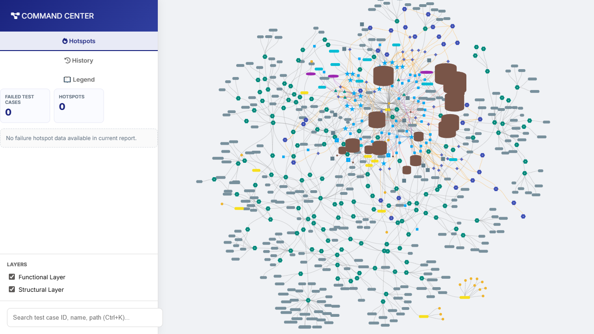
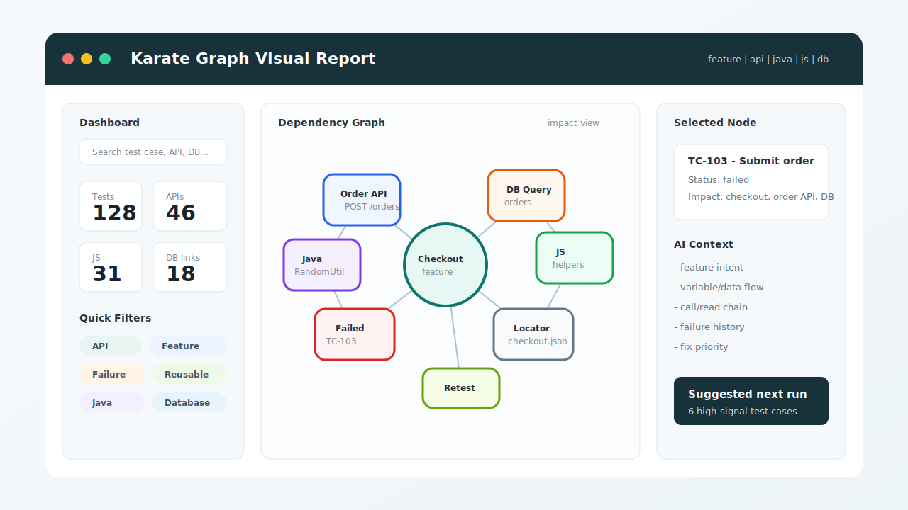

# Karate Graph

Karate Graph is an MCP-powered analyzer for Karate Framework projects. It helps AI agents scan `.feature` files, Java helpers, JavaScript helpers, database usage, execution reports, and dependency graphs so the AI can answer impact, reuse, failure, and visual-report questions with project context.

## What It Helps With

- Scan Karate projects and build dependency graphs.
- Generate interactive visual HTML reports.
- Search API, workflow, feature, Java, JavaScript, DB, and reusable helper usage.
- Analyze change impact and suggest test cases to rerun.
- Inspect failure hotspots, flaky risk, execution history, and debug context.
- Help AI understand feature intent, variables, assertions, duplicate steps, and call/read chains.

## Visual Report Preview

Real project scan:



Clean overview mockup:



## Install

Install from PyPI:

```bash
pip install -U karate-graph
```

Install a specific version:

```bash
pip install -U karate-graph==0.1.1
```

Verify the package:

```bash
python -m pip show karate-graph
python -m karate_graph_analyzer.mcp_server --help
```

If `karate-graph-mcp` is on your `PATH`, this also works:

```bash
karate-graph-mcp --help
```

On Windows, if `where karate-graph-mcp` cannot find the command, use the `python -m` MCP config below. That avoids PATH issues.

## Configure MCP

Karate Graph is mainly used through an MCP client such as Codex, Claude Desktop, Cursor, or another AI tool that supports MCP.

### Recommended Windows Config

Use the full Python path from:

```bat
where python
```

Example Codex `config.toml`:

```toml
[mcp_servers.karate-graph]
command = "C:\\Program Files\\Python311\\python.exe"
args = ["-m", "karate_graph_analyzer.mcp_server"]
env = { PYTHONIOENCODING = "utf-8" }
```

If your Python is installed somewhere else, replace `command` with that path.

### Generic MCP JSON Config

```json
{
  "mcpServers": {
    "karate-graph": {
      "command": "python",
      "args": ["-m", "karate_graph_analyzer.mcp_server"],
      "env": {
        "PYTHONIOENCODING": "utf-8"
      }
    }
  }
}
```

### Local Source Development Config

Only use `PYTHONPATH` when you want the MCP server to run directly from your local repo source instead of the package installed by pip.

```json
{
  "mcpServers": {
    "karate-graph": {
      "command": "python",
      "args": ["-m", "karate_graph_analyzer.mcp_server"],
      "env": {
        "PYTHONPATH": "E:/Project/auto/karate_graph/src",
        "PYTHONIOENCODING": "utf-8"
      }
    }
  }
}
```

After editing MCP config, restart your MCP client.

## End-To-End Usage

The normal flow is:

1. Check MCP server health.
2. Register the Karate project.
3. Analyze the project.
4. Generate the visual report.
5. Use search, impact, DB, reuse, and failure tools.

### 1. Health Check

Ask your AI to call:

```text
mcp_health()
mcp_version()
list_projects()
```

Expected result:

- MCP server is reachable.
- Package version is returned.
- Existing registered projects are listed.

### 2. Register Project

Register a Karate project once:

```text
register_project(
  name="karate-core",
  root_path="E:/Project/auto/karate-fw/karate-core",
  feature_file_patterns=["**/*.feature"]
)
```

Notes:

- `name` is the project alias used by all other tools.
- `root_path` should be the absolute path to the Karate project.
- `feature_file_patterns` can be omitted; default is usually `["**/*.feature"]`.

For very large projects where real test cases live only under `feature(s)/**testcase`,
enable strict test-case directory mode. This lets reusable feature packages such as
`reuse`, `shared`, `helpers`, or `services` stay outside the test-case count without
renaming the project structure:

```text
register_project(
  name="karate-core",
  root_path="E:/Project/auto/karate-fw/karate-core",
  feature_file_patterns=["**/*.feature"],
  parser_config={
    "strict_test_case_directory_mode": true,
    "test_case_directories": ["testcase", "testcases"],
    "feature_root_directories": ["feature", "features"],
    "default_non_test_feature_type": "COMMON",
    "common_directories": ["common", "services", "reuse", "reusable", "shared", "helpers"],
    "scan_exclude_directories": [
      ".git", ".gradle", ".idea", ".karate_cache", "build", "dist",
      "node_modules", "out", "output", "reports", "target"
    ],
    "javascript_file_patterns": ["**/*.js"],
    "large_project_streaming_scan": true,
    "scan_log_every": 2000,
    "visualization_large_graph_threshold": 1500,
    "visualization_physics_enabled": null,
    "visualization_node_limit": 5000,
    "visualization_edge_limit": 12000,
    "visualization_progressive_enabled": true,
    "visualization_chunk_size": 1000,
    "visualization_auto_load_chunks": 0,
    "cycle_detection_enabled": true,
    "cycle_detection_node_limit": 20000,
    "ai_context_cache_feature_threshold": 5000,
    "ai_context_similarity_pool_limit": 1000,
    "ai_context_duplicate_location_limit": 25
  }
)
```

When `parser_config` is provided, Karate Graph still keeps values auto-detected from
`karate-config*.js` and only applies the explicit overrides above.

For projects with tens of thousands of feature files, prefer narrow feature patterns
when possible:

```text
feature_file_patterns=[
  "src/test/java/features/**/*testcase/**/*.feature",
  "src/test/java/feature/**/*testcase/**/*.feature",
  "src/test/java/features/**/reuse/**/*.feature",
  "src/test/java/feature/**/reuse/**/*.feature"
]
```

Performance tips:

- Use `large_project_streaming_scan=true` for very large repositories. It avoids keeping every parsed feature AST in memory.
- If not set manually, streaming scan is automatically used when the matched feature count reaches `large_project_streaming_threshold` (default `20000`).
- Keep `include_structural_nodes=false` for the first scan. Turn it on only when you need folder/file nodes in the visual graph.
- Keep `scan_exclude_directories` updated with generated folders such as `target`, `reports`, `output`, and `node_modules`.
- Narrow `javascript_file_patterns` if only some JavaScript folders matter, for example `["src/test/java/**/*.js", "src/test/resources/**/*.js"]`.
- For huge graphs, leave `visualization_physics_enabled=null`. Karate Graph will disable physics automatically after `visualization_large_graph_threshold` nodes.
- Full 100k-node interactive canvases are not practical in a browser. The report opens with a capped working view (`visualization_node_limit`) and, when `visualization_progressive_enabled=true`, writes extra `.js` chunks next to the HTML so you can load more nodes from the report without freezing the first page load.
- Keep `visualization_auto_load_chunks=0` for very large reports. Use the report's `Load more` button to add chunks on demand.
- Keep `cycle_detection_node_limit` enabled. Full cycle enumeration is skipped above the limit because it can dominate scan time on 100k-node graphs.
- AI feature/DB context tools stream large feature sets instead of caching every parsed AST after `ai_context_cache_feature_threshold`.
- `scenario_similarity_map` uses `ai_context_similarity_pool_limit` to avoid O(N²) comparisons across the whole repository.
- Duplicate step/flow tools count all matches but only keep `ai_context_duplicate_location_limit` example locations per group.

### 3. Scan / Analyze Project

Build the dependency graph:

```text
analyze_project(
  project_name="karate-core",
  include_structural_nodes=true
)
```

Use `include_structural_nodes=true` when you want the visual report to include folder/file structure. Use `false` for a cleaner graph focused on test and dependency nodes.

### 4. Generate Visual Report

Create the interactive HTML graph:

```text
visualize_project(
  project_name="karate-core",
  output_path="E:/Project/auto/karate-fw/karate-core/output/karate_graph.html"
)
```

Open the generated file in your browser:

```text
E:/Project/auto/karate-fw/karate-core/output/karate_graph.html
```

The dashboard supports search by:

- test case ID or Jira tag
- scenario name
- feature path
- API path
- Java class or method
- JavaScript file or function
- database table, host, provider, or query keyword

### 5. Render Execution Report

If you have Karate JSON execution reports, process a report folder:

```text
process_reports_folder(
  project_name="karate-core",
  directory_path="E:/Project/auto/karate-fw/karate-core/target/karate-reports",
  output_path="E:/Project/auto/karate-fw/karate-core/output/execution_graph.html"
)
```

Or render one report file:

```text
render_execution_report(
  project_name="karate-core",
  report_path="E:/Project/auto/karate-fw/karate-core/target/karate-reports/karate-summary-json.txt",
  output_path="E:/Project/auto/karate-fw/karate-core/output/execution_graph.html"
)
```

Execution reports add pass/fail/not-run status, failure hotspots, flaky risk, failure history, and debug context.

## Common AI Prompts

After MCP is configured, you can ask your AI:

```text
Register project karate-core at E:/Project/auto/karate-fw/karate-core and analyze it.
```

```text
Generate visual report for karate-core and tell me the output file path.
```

```text
Search all test cases related to order creation.
```

```text
Find reusable random string or random number helpers before adding a new one.
```

```text
If locators/checkout.json changes, which test cases are impacted?
```

```text
Which feature steps are duplicated and safe to refactor?
```

```text
Which test cases touch the orders table?
```

```text
Show the top failure hotspots and prioritize what to fix first.
```

```text
Build an AI debug context pack for this failed node and error message.
```

## Tool Groups

### Project And Graph

- `mcp_health()` checks MCP server connectivity.
- `mcp_version()` returns package version.
- `register_project(name, root_path, feature_file_patterns, parser_config)` registers a project.
- `list_projects()` lists registered projects.
- `delete_project(name)` removes one project from registry.
- `clear_all_projects()` resets all registered projects.
- `analyze_project(project_name, include_structural_nodes)` scans a project and builds graph data.
- `bulk_analyze()` analyzes all registered projects.
- `query_dependencies(component_id, transitive)` finds dependencies of a component.
- `impact_analysis(component_id)` finds impacted tests and workflows from a changed component.
- `get_subgraph(node_id, radius)` returns local graph context around a node.
- `find_path(source_id, target_id)` finds dependency paths between nodes.
- `global_search(query)` searches all graph nodes.
- `query_node_by_metadata(key, value)` searches graph nodes by metadata.

### Visual And Export

- `visualize_project(project_name, output_path)` generates an interactive graph HTML file.
- `render_execution_report(project_name, report_path, output_path)` generates a graph from one execution report.
- `process_reports_folder(project_name, directory_path, output_path)` scans a report folder and generates execution visualization.
- `compare_projects(base_project_name, new_project_name, output_path)` creates a diff visualization.
- `merge_projects(project_names, new_project_name)` merges multiple project graphs.
- `export_graph(project_name, format)` exports graph data as `json` or `graphml`.

### API, Workflow, Test Case, Page

- `search_api(project_name, method, path, domain)` searches API endpoints.
- `get_api_stats(project_name, keyword)` summarizes API usage.
- `search_workflow(project_name, path, scenario_tag, keyword)` searches workflow/scenario usage.
- `search_test_case(project_name, jira_tag, name_pattern)` searches test cases by ID/tag/name.
- `get_page_stats(project_name, domain)` summarizes page/action usage.
- `common_usage_map(project_name, limit)` shows commonly reused components.
- `unused_components(project_name, limit)` lists unused components.

### Java And JavaScript Reuse

- `search_java_usage(project_name, query, include_methods)` finds Java class/method usage and linked tests.
- `search_js_usage(project_name, query, include_functions)` finds JavaScript file/function usage and linked tests.
- `javascript_structure_map(project_name, limit)` shows JS files, functions, dependencies, and test usage.
- `search_reusable_function(project_name, query, language, limit)` searches Java/JS helpers for reuse candidates.

`search_reusable_function` returns tags, aliases, usage examples, stability score, source location, and related test usage where available.

### Smart Retest And Change Impact

- `change_impact_preview(project_name, changed_paths, limit)` previews tests impacted by changed files/components.
- `test_selection_suggestion(project_name, changed_paths, limit)` suggests a compact rerun set.
- `get_impact_radius(node_id, depth)` shows impact within a graph radius.
- `get_component_importance(project_name)` ranks important graph components.

Example:

```text
change_impact_preview(
  project_name="karate-core",
  changed_paths=["src/test/java/helpers/RandomUtil.java", "locators/checkout.json"],
  limit=30
)
```

### Feature Understanding

- `feature_intent_index(project_name, query, limit)` summarizes scenario intent and major signals.
- `feature_behavior_map(project_name, feature_path, scenario_tag, scenario_name, node_id, limit)` groups preconditions, actions, and expectations.
- `variable_data_flow_trace(project_name, feature_path, scenario_tag, scenario_name, node_id, limit)` traces variables from definition to usage.
- `assertion_map(project_name, query, limit)` indexes status/match/assert checks.
- `call_read_deep_context(project_name, feature_path, scenario_tag, scenario_name, node_id, max_depth, limit)` expands nested call/read chains.
- `ai_feature_context_pack(project_name, feature_path, scenario_tag, scenario_name, node_id, max_call_depth, limit)` returns an AI-ready context pack.
- `scenario_similarity_map(project_name, query, limit, top_k)` finds similar scenarios.
- `feature_reuse_advisor(project_name, min_group_size, min_flow_length, limit, include_low_signal)` finds duplicate steps and repeated flows.
- `similar_common_components(project_name, limit)` finds common components with similar dependency shape.

Use `include_low_signal=false` in `feature_reuse_advisor` to ignore generic Karate template steps such as `When method POST` or `Then status 201`.

### Database Understanding

- `db_query_index(project_name, query, limit, include_components, link_status)` indexes DB queries and DB components.
- `search_db_usage(project_name, query, limit, link_status)` searches by table, operation, host, dialect, provider, path, or query keyword.
- `db_data_flow_trace(project_name, feature_path, scenario_tag, scenario_name, node_id, limit)` traces DB variables, calls, and assertions.
- `db_assertion_map(project_name, query, limit)` indexes DB-related assertions.
- `db_impact_preview(project_name, changed_entities, limit)` previews impacted tests from changed DB entities.

Supported DB detection includes PostgreSQL, MySQL, MariaDB, Oracle, SQL Server, SQLite, DB2, H2, Redshift, Snowflake, ClickHouse, MongoDB, Redis, DynamoDB, Cassandra/CQL, Elasticsearch/OpenSearch, Neo4j/Cypher, and generic SQL.

Example:

```text
db_impact_preview(
  project_name="karate-core",
  changed_entities=["orders", "postgres", "jdbc:postgresql"],
  limit=30
)
```

### Failure Debugging

- `get_failure_hotspots(project_name)` finds components contributing most to failures.
- `top_hotspots(project_name, limit)` returns top failure hotspots.
- `prioritize_fix_queue(project_name, limit)` ranks fixes by failure impact and risk.
- `flaky_risk(project_name, limit)` finds test cases with mixed pass/fail history.
- `search_error_pattern(project_name, pattern, limit)` searches failed nodes by error text or fingerprint.
- `get_failure_history(project_name, node_id)` returns execution trend and flaky score.
- `get_failure_debug_context(project_name, node_id, error_message, radius, max_historical)` builds an AI debug pack.
- `record_fix(project_name, node_id, error_message, solution, description)` records a known fix.
- `get_fix_suggestions(project_name, node_id, error_message)` finds historical fix suggestions.
- `auto_fix_hint_pack(project_name, node_id, error_message, max_historical)` builds a step-by-step fix checklist.

## Typical Workflows

### Find Existing Helper Before Coding

```text
search_reusable_function(
  project_name="karate-core",
  query="random string random number uuid",
  language="all",
  limit=20
)
```

Use the highest-score helper when the tags, aliases, examples, and stability score match your need.

### Check What A File Change Impacts

```text
test_selection_suggestion(
  project_name="karate-core",
  changed_paths=["src/test/java/helpers/RandomUtil.java"],
  limit=20
)
```

Use this before running regression to choose a smaller high-signal test set.

### Understand A Feature Before Editing

```text
ai_feature_context_pack(
  project_name="karate-core",
  feature_path="checkout.feature",
  max_call_depth=3,
  limit=10
)
```

This gives the AI intent, variable flow, assertions, call/read chain, and graph context.

### Find Duplicate Feature Steps

```text
feature_reuse_advisor(
  project_name="karate-core",
  min_group_size=2,
  min_flow_length=3,
  limit=50,
  include_low_signal=false
)
```

Use this to find duplicate steps or repeated flows that can be extracted into reusable feature components.

### Debug Failed Regression

```text
process_reports_folder(
  project_name="karate-core",
  directory_path="E:/Project/auto/karate-fw/karate-core/target/karate-reports"
)
```

Then ask:

```text
top_hotspots(project_name="karate-core", limit=10)
prioritize_fix_queue(project_name="karate-core", limit=10)
get_failure_debug_context(project_name="karate-core", node_id="<failed-node-id>")
```

## Troubleshooting

### `where karate-graph-mcp` Cannot Find The Command

The package may be installed correctly, but the Python `Scripts` folder is missing from `PATH`.

Use this instead:

```bash
python -m karate_graph_analyzer.mcp_server --help
```

And configure MCP with:

```toml
[mcp_servers.karate-graph]
command = "C:\\Program Files\\Python311\\python.exe"
args = ["-m", "karate_graph_analyzer.mcp_server"]
env = { PYTHONIOENCODING = "utf-8" }
```

### MCP Command Looks Like It Is Hanging

That is normal when running the MCP server without a client:

```bash
python -m karate_graph_analyzer.mcp_server
```

The server is waiting for MCP stdio messages from the AI client.

### Do Not Patch `site-packages` Manually

Avoid editing installed files under paths like:

```text
C:/Users/<user>/AppData/Roaming/Python/Python311/site-packages/karate_graph_analyzer
```

If there is a real package bug, fix the source repo, bump the package version, publish a new version, and upgrade with:

```bash
pip install -U karate-graph==<new-version>
```

Manual patches are overwritten by pip upgrades and do not help other machines.

## Development

Install local development dependencies:

```bash
git clone <repository-url>
cd karate-graph
pip install -e ".[dev]"
```

Run tests:

```bash
pytest
```

Build and validate package:

```bash
python -m pip install build twine
python -m build
python -m twine check dist/*
```

Publish to TestPyPI before PyPI:

```bash
python -m twine upload --repository testpypi dist/*
python -m twine upload dist/*
```

Use a PyPI API token with `TWINE_USERNAME=__token__`.

## Project Structure

```text
karate-graph/
|-- src/karate_graph_analyzer/
|   |-- mcp_server.py
|   |-- mcp_interface/
|   |-- parser/
|   |-- graph/
|   |-- services/
|   |-- utils/
|   `-- visualization/
|-- tests/
`-- pyproject.toml
```

## License

MIT
